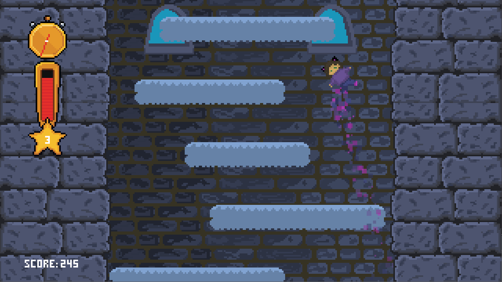

# Icy Tower Pygame
> Gra inspirowana popularną grą Icy Tower wykonana przy użyciu Pythona oraz biblioteki Pygame
## Spis treści
* [Ogólne Informacje](#ogólne-informacje)
* [Cechy Projektu](#cechy-projektu)
* [Grafika z Gry](#grafika-z-gry)
* [Uruchamianie Gry](#uruchamianie-gry)
* [Twórcy](#twórcy)

## Ogólne Informacje
- Projekt na PWI
- Odtworzenie gry Icy Tower z 2001 przy użyciu Pythona oraz Pygame
- Dostosowanie gry do obecnych standardów sprzętowych

## Cechy Projektu
- Mechanika bazująca na oryginalnym Icy Tower z 2001 roku
- Oprawa graficzna w stylu pixel art
- Autorska ścieżka dzwiękowa
- Rozdzielczość oraz częstotliwość odświeżania gry dostosowana do standardów z 2023 roku

## Grafika z Gry

## Uruchamianie Gry
Projekt został przetestowany na systemie operacyjnym Windows 10 oraz Windows 11 i są to zalecane systemy operacyjne do uruchomiernia gry.
Do uruchomienia gry niezbędne są interpreter Pythona (od wersji 3.10 w górę) oraz moduł Pygame (w wersji co najmniej 2.1).

Żeby uruchomić grę należy uruchomić plik main.py przy użyciu interpretera Pythona.

Program zostawia użytkownikowi otwarty plik ze stałymi properties.py, gdzie można dowolnie dostosować fizykę gry pod własne preferencję (jest to niezalecane).

## Twórcy
Zespół nr 6 PWI z kierunu Informatyka na Uniwersytecie Wrocławskim w składzie:
- Marcin Banak
- Karol Burczyk
- Julia Cygan
- Katarzyna Jodłowska
- Bartosz Kruszewski
- Miłosz Krzysiek
- Maciej Szałasz
